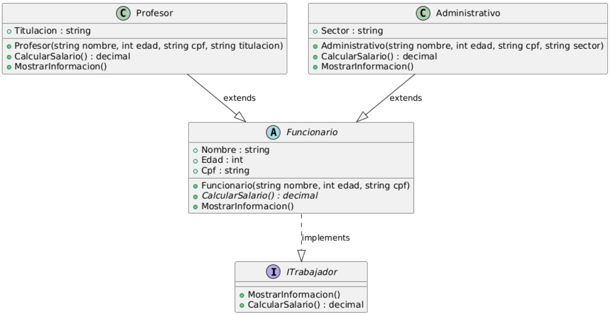

# Tarea 2

Este proyecto demuestra el uso de programación Orientada a Objetos (POO) en C# mediante la creación de una jerarquía de clases que representa a diferentes tipos de **funcionarios** dentro de una organización.

Se aplican los principales conceptos de POO:

* **Abstracción:** con una clase base abstracta `Funcionario`.
* **Herencia:** las clases `Profesor` y `Administrativo` extienden de `Funcionario`.
* **Polimorfismo:** ambos tipos de funcionarios comparten una interfaz común (`ITrabajador`), pero implementan comportamientos específicos.
* **Encapsulamiento:** atributos privados y propiedades públicas.
* **Interfaces:** definen contratos comunes (`ITrabajador`).



## Estructura del proyecto

```
ProyectoFuncionarios/
 ├── Program.cs
 ├── Models/
 │   ├── ITrabajador.cs
 │   ├── Funcionario.cs
 │   ├── Profesor.cs
 │   └── Administrativo.cs
 └── README.md
```

## Conceptos POO aplicados

| Concepto            | Ejemplo                                                          |
| ------------------- | ---------------------------------------------------------------- |
| **Herencia**        | `Profesor` y `Administrativo` heredan de `Funcionario`           |
| **Abstracción**     | `Funcionario` define estructura común y métodos abstractos       |
| **Polimorfismo**    | Uso de `List<ITrabajador>` con distintos tipos de funcionarios   |
| **Encapsulamiento** | Propiedades controladas con `get` y `set`                        |
| **Interfaces**      | `ITrabajador` garantiza que todos implementen los mismos métodos |

## Pasos para ejecutar

1. **Restaurar dependencias**

   ```bash
   dotnet restore
   ```

2. **Compilar el proyecto**

   ```bash
   dotnet build
   ```

3. **Ejecutar el programa**

   ```bash
   dotnet run
   ```
